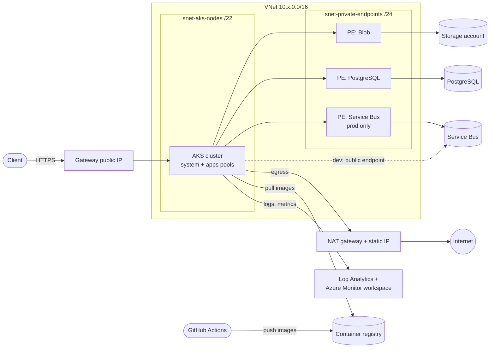
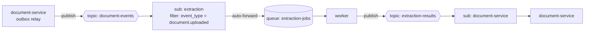
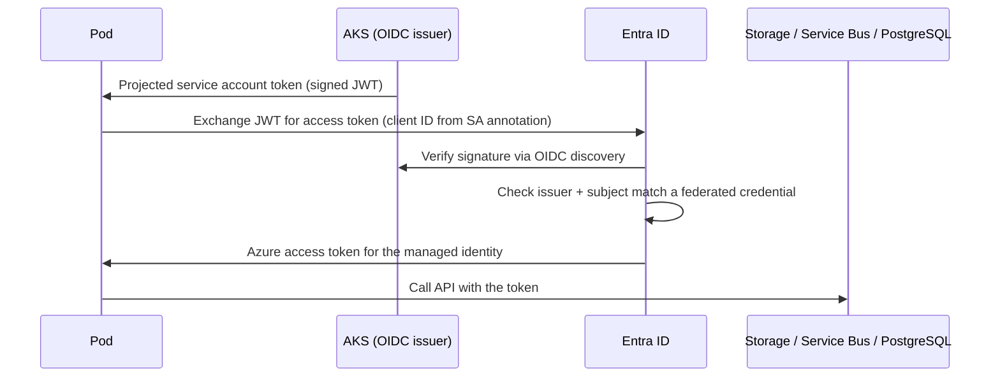

# Azure infrastructure explained

This guide covers every Azure resource that the Terraform in [`infra/`](../infra/)
creates, and why each one is configured the way it is. It's written for
developers who know Kubernetes and Terraform but are new to Azure.

[`infra/README.md`](../infra/README.md) is the operational guide (how to run
it). This document explains what gets built and the reasons behind it. For the
Entra ID identities you create by hand, see
[`entra-identities.md`](entra-identities.md).

**Contents**

1. [Azure concepts you need first](#1-azure-concepts-you-need-first)
2. [The big picture](#2-the-big-picture)
3. [Layer 1: bootstrap (one time)](#3-layer-1-bootstrap-one-time)
4. [Layer 2: one environment](#4-layer-2-one-environment)
   - [Network](#41-network-modulesnetwork)
   - [Monitoring](#42-monitoring-modulesmonitoring)
   - [Container registry](#43-container-registry-modulesregistry)
   - [Service Bus](#44-service-bus-modulesmessaging)
   - [Blob storage](#45-blob-storage-modulesstorage)
   - [PostgreSQL](#46-postgresql-modulespostgres)
   - [AKS](#47-aks-modulesaks)
   - [Workload identities](#48-workload-identities-modulesidentities)
   - [Delete locks](#49-delete-locks-maintf)
5. [Who can talk to what](#5-who-can-talk-to-what)
6. [Dev vs prod](#6-dev-vs-prod)
7. [What Terraform does not do](#7-what-terraform-does-not-do)
8. [Glossary](#8-glossary)

---

## 1. Azure concepts you need first

Most of the design decisions below follow from a few Azure concepts. If you
know AWS or GCP, the rough equivalents are given in brackets.

**Tenant and Entra ID.** A *tenant* is your organization's identity directory.
*Microsoft Entra ID* (formerly Azure Active Directory) is the service that
holds the users, groups and applications in it. Every sign-in to Azure, human
or machine, is an Entra ID sign-in. (≈ AWS IAM Identity Center / Google Cloud
Identity)

**Subscription.** The billing and access boundary that resources live in. This
project uses one subscription for both dev and prod. (≈ AWS account / GCP
project)

**Resource group.** A folder for resources inside a subscription. Every
resource belongs to exactly one. Resource groups are the usual scope for
permissions and for deleting things together. This stack uses several of them
(see [the big picture](#2-the-big-picture)).

**Region and availability zones.** Everything runs in `canadacentral`. A region
has three *availability zones*: separate datacenters with independent power and
networking. A resource is either *zonal* (pinned to one zone), *zone-redundant*
(spread across zones by Azure), or neither. Much of the configuration below is
about surviving the loss of one zone.

**Management plane vs data plane.** This distinction matters a lot here.
- The *management plane* (Azure Resource Manager, "ARM") is the API for
  creating, configuring and deleting resources: "create a storage account",
  "add a queue". Terraform talks to it.
- The *data plane* is the API for using a resource: "upload this blob", "send
  this message", "run this SQL". The application talks to it.

Permissions for the two planes are separate. Being able to create a storage
account doesn't let you read the blobs in it, and the reverse is also true.

**Azure RBAC and role assignments.** Permissions are granted by a *role
assignment*, which has three parts: *who* (a principal), *what* (a role such as
`Storage Blob Data Contributor`), and *where* (a scope: a subscription, a
resource group, one resource, or even one queue). Assignments inherit
downwards, so a role on a resource group applies to everything in it. (≈ IAM
policy attachments)

**Managed identities.** An Entra ID identity for a workload rather than a
person. Azure manages its credentials, so there is no password or key to store
or rotate. A *user-assigned* managed identity is a standalone resource that you
create and then attach to things. That's the kind used throughout this stack.
(≈ IAM roles for service accounts)

**Federated identity credentials.** These let an external identity provider
(GitHub Actions, or the Kubernetes cluster) sign in as a managed identity
without any secret. The external system issues a signed OIDC token. Entra ID
checks that the token's issuer and subject match the federated credential and
then returns an Azure access token in exchange. This is how both CI and the
pods authenticate.

**Shared keys / local auth.** Many Azure services also accept a static key or
connection string, and historically that was the default. This stack turns
those keys off everywhere, so the only way in is an Entra ID token. A leaked
`.env` file therefore can't expose anything, because no such secret exists.

**Private endpoints and private DNS.** By default, an Azure PaaS service
(Storage, PostgreSQL, Service Bus) has a public endpoint on the internet. A
*private endpoint* puts a network interface for that service inside your
virtual network, with a private IP. You can then disable the public endpoint
completely. The service still uses its normal name (for example
`stdocprocessorprodap.blob.core.windows.net`). A *private DNS zone* such as
`privatelink.blob.core.windows.net`, linked to the VNet, makes that name
resolve to the private IP for anything inside the VNet. Code doesn't change at
all: the same hostname goes to a private address. (≈ AWS PrivateLink)

**SKUs and tiers.** Most Azure services come in tiers (Basic / Standard /
Premium, Burstable / General Purpose, and so on). The tier often decides
features, not only capacity. For example, Service Bus *Standard* can't have a
private endpoint and *Premium* can. Dev and prod pick tiers differently for
this reason.

---

## 2. The big picture

There are two Terraform configurations:

| | `infra/bootstrap/` | `infra/` (root) |
|---|---|---|
| Run | Once, by a subscription Owner, from a laptop | Once per environment, repeatedly |
| State | Local file (`terraform.tfstate`) | Remote, in the state storage account |
| Creates | State storage, resource groups, CI identities, provider registrations | Everything the app runs on |

Bootstrap exists because of a chicken-and-egg problem. The environment stack
needs somewhere to store its state, resource groups to deploy into, and an
identity with permission to deploy. Something with higher privileges has to
create those first.

### Resource groups

```
Subscription
├── rg-docprocessor-tfstate            (bootstrap)  state account, CI identities
├── rg-docprocessor-dev                (bootstrap)  dev workload resources
├── rg-docprocessor-dev-network        (bootstrap)  dev VNet, NAT, public IPs, private DNS
├── rg-docprocessor-dev-aks-nodes      (AKS)        VMs, disks, load balancer for dev
├── rg-docprocessor-prod               (bootstrap)
├── rg-docprocessor-prod-network       (bootstrap)
└── rg-docprocessor-prod-aks-nodes     (AKS)
```

- **Workload vs network groups.** Networking is kept separate so that it could
  be owned by a different team, and so that AKS only needs network permissions
  on the network group, not on the whole workload.
- **The `-aks-nodes` group** is created and owned by AKS itself (Azure calls it
  the "node resource group"; by default it's named `MC_...`). It holds the
  VMs, disks and load balancer behind the cluster. Don't edit things in it by
  hand. AKS will overwrite or break them. The name is set explicitly in
  [`modules/aks/main.tf`](../infra/modules/aks/main.tf) so it's easy to find.

### One environment, at a glance



---

## 3. Layer 1: bootstrap (one time)

File: [`infra/bootstrap/main.tf`](../infra/bootstrap/main.tf)

### Resource provider registration

```hcl
resource_provider_registrations = "core"
resource_providers_to_register  = ["Microsoft.ContainerService", ...]
```

Before a subscription can create a type of resource, the matching *resource
provider* (for example `Microsoft.ServiceBus`) has to be registered on it.
Registering providers needs subscription-wide rights. Bootstrap runs as Owner,
so it registers all of them once. The environment stack then sets
`resource_provider_registrations = "none"`
([`infra/versions.tf`](../infra/versions.tf)), because the CI identity only has
rights on its own resource groups and would fail if it tried.

### Terraform state storage

| Resource | Name |
|---|---|
| `azurerm_resource_group.tfstate` | `rg-docprocessor-tfstate` |
| `azurerm_storage_account.tfstate` | `stdocprocessortfstate` |
| `azurerm_storage_container.tfstate` | `tfstate` (one blob per environment: `dev.tfstate`, `prod.tfstate`) |
| `azurerm_management_lock.tfstate` | `cannot-delete` |

A *storage account* is Azure's object storage service (≈ an S3 bucket
namespace). A *container* inside it is a folder of *blobs* (files). The
`azurerm` Terraform backend stores state as a blob and uses blob leases for
state locking.

Configuration and why:

- **`account_replication_type = "ZRS"`**: zone-redundant storage keeps three
  copies across three zones. Losing the state file would be very painful, so
  it's worth the small extra cost.
- **`shared_access_key_enabled = false`** and
  **`default_to_oauth_authentication = true`**: no account keys. Terraform
  authenticates with your Entra ID login (`use_azuread_auth = true` in the
  backend, `storage_use_azuread = true` in the provider).
- **`versioning_enabled = true`**, plus **30-day soft delete** for blobs and
  containers: every state write keeps the previous version, so a corrupted or
  wrongly applied state can be rolled back.
- **`allow_nested_items_to_be_public = false`**, **`min_tls_version =
  "TLS1_2"`**: standard hardening that prevents anyone from making a container
  public.
- **The `CanNotDelete` lock**: a *management lock* blocks deletion of the
  resource for everyone, including Owners, until someone removes the lock
  deliberately. It guards against a stray `terraform destroy` or a portal
  mis-click.

### Per environment (`dev`, `prod`)

| Resource | Name | Purpose |
|---|---|---|
| `azurerm_resource_group.workload` | `rg-docprocessor-<env>` | App resources |
| `azurerm_resource_group.network` | `rg-docprocessor-<env>-network` | Network resources |
| `azurerm_user_assigned_identity.ci` | `id-docprocessor-<env>-github` | The identity GitHub Actions deploys as |
| `azurerm_federated_identity_credential.ci` | `github-<env>` | Lets GitHub sign in as that identity |

**The CI identity and GitHub OIDC.** GitHub Actions can issue an OIDC token
that describes the running job. The federated credential trusts tokens only
when:

```
issuer  = https://token.actions.githubusercontent.com
subject = repo:<owner>/<repo>:environment:<env>
```

Only jobs that run in the matching **GitHub environment** can become this
identity. GitHub environments can require reviewers before a job starts. So
"deploying to prod needs approval" is enforced by GitHub, and Azure accepts
nothing else: no client secret exists that could be copied out.

There is one identity per environment, so a compromised dev pipeline can't
touch prod.

### What the CI identity is allowed to do

The goal is to give CI enough rights to run the stack, and nothing more.

| Role assignment | Scope | Why |
|---|---|---|
| `Contributor` | The env's workload and network RGs | Create, update and delete resources. Contributor can't grant permissions or manage locks. |
| `Role Based Access Control Administrator`, **with a condition** | Same two RGs | The stack creates role assignments (for example "pods may read blobs"), so CI must be able to grant roles. The condition limits it to the seven roles the stack actually uses (AcrPull, Network Contributor, Storage Blob Data Contributor, the three Service Bus Data roles, Managed Identity Operator). CI can't grant itself `Owner`. |
| Custom role `docprocessor-lock-operator` | The env's workload RG | Contributor can't create or remove management locks, and the stack places locks in prod. This custom role allows only `Microsoft.Authorization/locks/*`. |
| `Storage Blob Data Contributor` | The `tfstate` container | Read and write the state blobs (a data-plane permission, separate from Contributor). Scoped to the container, the narrowest scope Azure RBAC supports for blobs. |

The condition on the RBAC Administrator assignment is an **ABAC condition**
(attribute-based access control). It reads as: "if this is a role assignment
write or delete, the role being assigned must be one of these GUIDs".

The `time_sleep.lock_operator_propagation` resource waits 60 seconds after
creating the custom role. New role definitions take a while to replicate
inside Azure, and assigning one immediately fails with
`RoleDefinitionDoesNotExist`.

Finally, `operator_state` gives **the person running bootstrap** blob access
to the state container, so they can run the first `terraform plan` from their
laptop.

---

## 4. Layer 2: one environment

File: [`infra/main.tf`](../infra/main.tf). It runs once per environment with
`envs/<env>.tfvars` and `envs/<env>.backend.hcl`. Each environment has its own
state file. The code is identical across environments; only the variables
differ (see [Dev vs prod](#6-dev-vs-prod)).

The two resource groups aren't created here. They're read as `data` sources,
because bootstrap owns them.

Every resource gets these tags: `app = saas-docprocessor`,
`environment = <env>` and `managed-by = terraform`. Tags help with cost
reports and tell people not to edit those resources by hand.

### 4.1 Network (`modules/network`)

File: [`infra/modules/network/main.tf`](../infra/modules/network/main.tf).
Everything here lives in the **network** resource group.

#### Virtual network and subnets

| Resource | Address range (prod example) | Holds |
|---|---|---|
| `vnet-docprocessor-<env>` | `10.20.0.0/16` (dev: `10.30.0.0/16`) | Everything below |
| `snet-aks-nodes` | `10.20.0.0/22` (1,019 usable IPs) | AKS node VMs |
| `snet-private-endpoints` | `10.20.4.0/24` | Private endpoints for Storage, PostgreSQL and Service Bus |

A *VNet* is your private network in Azure (≈ an AWS VPC). *Subnets* divide it.

- **Why a /22 is enough for nodes:** AKS uses **Azure CNI Overlay** (see
  [AKS](#47-aks-modulesaks)). Pods get IPs from a separate overlay range
  (`10.244.0.0/16`), not from the VNet. Only the nodes use VNet addresses, so
  1,019 addresses gives plenty of headroom.
- **Different `/16`s for dev and prod** mean the two VNets could be peered
  (connected) later without address clashes.
- **A separate subnet for private endpoints** makes it easy to write
  Kubernetes network policies such as "pods may reach the private endpoint
  subnet". The subnet's CIDR is exported as `private_endpoints_cidr` for
  [`k8s/network_policy.yaml`](../k8s/network_policy.yaml).
- **`default_outbound_access_enabled = false`**: Azure used to give VMs an
  implicit, unannounced outbound internet IP. That's being retired and is
  hard to audit. Turning it off means the only way out is the NAT gateway.

#### NAT gateway (outbound traffic)

| Resource | Name |
|---|---|
| `azurerm_public_ip.nat` | `pip-docprocessor-<env>-nat` (StandardV2, static) |
| `azurerm_nat_gateway.this` | `ng-docprocessor-<env>` (StandardV2) |
| associations | NAT ↔ public IP, NAT ↔ node subnet |

A *NAT gateway* gives everything in a subnet a single, fixed outbound IP
address.

- **Why:** all traffic leaving the cluster (calls to external APIs, image
  pulls from public registries) comes from one known IP, exported as the
  `egress_public_ip` output. Partners can add it to their allow lists.
- **Why StandardV2:** the older Standard SKU is pinned to one zone, so a zone
  outage would cut off all egress. StandardV2 is zone-redundant.
- **`idle_timeout_in_minutes = 4`:** the default. Idle TCP flows are dropped
  after 4 minutes, so long-lived connections need keepalives. The Azure SDKs
  handle this.

#### Gateway public IP (inbound traffic)

`azurerm_public_ip.gateway` (`pip-docprocessor-<env>-gateway`, Standard SKU,
zones 1–3, static).

This is the public address of the API. The Kubernetes Gateway in
[`k8s/gateway.yaml`](../k8s/gateway.yaml) creates a LoadBalancer Service that
binds this IP **by name** (the `service.beta.kubernetes.io/azure-pip-name`
annotation).

- **Why create it in Terraform instead of letting AKS create it:** if AKS
  owned the IP, deleting and recreating the Gateway would give you a new IP
  and break DNS. Created here, it outlives anything in the cluster, so the DNS
  A record never has to change.
- **Why it's in the network group:** that's why the AKS control-plane identity
  needs `Network Contributor` on the network resource group (see
  [AKS](#47-aks-modulesaks)).

#### Private DNS zones

One `azurerm_private_dns_zone` and one VNet link for each of:

- `privatelink.blob.core.windows.net`
- `privatelink.servicebus.windows.net`
- `privatelink.postgres.database.azure.com`

Here's what happens when a pod resolves `stdocprocessorprodap.blob.core.windows.net`:

1. Public DNS answers with a CNAME to
   `stdocprocessorprodap.privatelink.blob.core.windows.net`.
2. That `privatelink.` zone is linked to the VNet, so Azure's resolver answers
   from the private zone with the private endpoint's IP (`10.20.4.x`).
3. Outside the VNet, the same name resolves to the public endpoint, which
   refuses the connection because public access is disabled.

The DNS records themselves are created automatically by each private
endpoint's `private_dns_zone_group` (see Storage, PostgreSQL and Service Bus
below).

The Service Bus zone is also created in dev, where it isn't used, so the
network looks the same in both environments.

### 4.2 Monitoring (`modules/monitoring`)

File: [`infra/modules/monitoring/main.tf`](../infra/modules/monitoring/main.tf)

Azure has two separate stores for observability data, and this stack uses
both:

| Resource | Name | Stores |
|---|---|---|
| `azurerm_log_analytics_workspace` | `log-docprocessor-<env>` | Logs: container stdout/stderr, Kubernetes events and inventory, API server audit logs. Queried with KQL. |
| `azurerm_monitor_workspace` | `amw-docprocessor-<env>` | Prometheus metrics (Azure's managed Prometheus). Queried with PromQL, for example from Grafana. |

- **`sku = "PerGB2018"`** is the standard pay-per-GB-ingested pricing.
- **`retention_in_days`**: 30 in dev, 90 in prod. Longer retention costs
  more, and prod needs a longer audit trail.
- **`local_authentication_enabled = false`**: no workspace keys. Agents send
  data with managed identities.

Data reaches these stores through **data collection rules (DCRs)**. A DCR
says "collect X and send it to Y". It's attached to a source (here, the AKS
cluster) by a *DCR association*, which the AKS module creates.

| Resource | What it does |
|---|---|
| `dce-docprocessor-<env>-prometheus` (data collection endpoint) | The endpoint the in-cluster Prometheus agents (`ama-metrics`) connect to for their configuration and to send metrics |
| `dcr-docprocessor-<env>-prometheus` | Routes the `Microsoft-PrometheusMetrics` stream to the Azure Monitor workspace. This is what scrapes [`k8s/pod_monitor.yaml`](../k8s/pod_monitor.yaml) targets. |
| `dcr-docprocessor-<env>-container-insights` | *Container Insights*: collects container logs (in the `ContainerLogV2` schema, which is cheaper and better structured), Kubernetes events and inventory every minute from all namespaces, and sends them to Log Analytics |

Traces aren't handled here. The services send OTLP to an OpenTelemetry
collector that's deployed with the workloads.

### 4.3 Container registry (`modules/registry`)

File: [`infra/modules/registry/main.tf`](../infra/modules/registry/main.tf)

`azurerm_container_registry` (`acrdocprocessorap` in prod,
`acrdocprocessordev` in dev). *Azure Container Registry (ACR)* is a private
Docker registry (≈ ECR).

- **`admin_enabled = false`**: ACR's "admin user" is a shared
  username/password. With it off, pushes and pulls need Entra ID.
- **`anonymous_pull_enabled = false`**: no unauthenticated pulls.
- **Public endpoint kept open.** Unlike the data services, ACR isn't behind a
  private endpoint. GitHub-hosted runners have no fixed IPs and aren't in the
  VNet, but they must push images. Authentication is still required, and only
  Entra ID works.
- **AKS pulls with its kubelet identity**, which gets `AcrPull` in the AKS
  module. No image pull secrets are needed in Kubernetes.
- **Premium only (prod):**
  - `zone_redundancy_enabled`: the registry survives a zone outage. Without
    it, nodes can't pull images to recover from that same outage.
  - `retention_policy_in_days = 7`: untagged manifests (old layers left
    behind when a tag is pushed again) are deleted after a week, which keeps
    storage costs down.

Registry names must be globally unique across all of Azure, alphanumeric
only. That's why the names are variables.

### 4.4 Service Bus (`modules/messaging`)

File: [`infra/modules/messaging/main.tf`](../infra/modules/messaging/main.tf)

*Azure Service Bus* is a managed message broker with queues (one consumer
group) and topics with subscriptions (pub/sub). A *namespace* is the
container for them, and its hostname is what the app connects to.

#### Topology



This matches [`local/servicebus-emulator-config.json`](../local/servicebus-emulator-config.json),
so local and cloud behave the same.

#### Namespace

`azurerm_servicebus_namespace` (`sb-docprocessor-<env>-ap`):

- **`local_auth_enabled = false`**: no SAS keys or connection strings. The
  app and KEDA authenticate with Entra ID.
- **`minimum_tls_version = "1.2"`**.
- **SKU decides networking:**
  - **Standard (dev):** cheaper, but Standard namespaces can't have private
    endpoints. The public endpoint stays on, still Entra ID only.
  - **Premium (prod):** dedicated capacity (`capacity = 1` messaging unit),
    zone-redundant, and `public_network_access_enabled = false`. A private
    endpoint (`pe-sb-docprocessor-prod-ap`, subresource `namespace`) is created
    in the private endpoint subnet.
  - Basic isn't allowed because it has no topics.

#### Entities and their settings

| Entity | Setting | Why |
|---|---|---|
| Queue `extraction-jobs` | `lock_duration = PT1M` | A receiver holds a *peek-lock* on a message for 1 minute. The worker renews the lock while it processes. If the worker crashes, the message becomes visible again after the lock expires. |
| | `max_delivery_count = 10` | After 10 failed deliveries Service Bus moves the message to the *dead-letter queue (DLQ)*. The worker dead-letters on its own after fewer attempts, so this is only a backstop. |
| | `default_message_ttl` (`P7D`) | Messages older than 7 days expire. |
| | `dead_lettering_on_message_expiration = true` | Expired messages go to the DLQ for inspection instead of disappearing. |
| Topic `document-events` | `requires_duplicate_detection = true`, 5-minute window | The outbox relay delivers *at least once*, so it may resend. Service Bus drops a message whose `MessageId` it has already seen in the last 5 minutes. |
| Subscription `extraction` | `forward_to = extraction-jobs` | *Auto-forwarding*: matching messages move into the queue automatically. The worker only reads one queue, and KEDA scales on that queue's length. |
| Rule `uploaded-only` | Correlation filter `event_type = document.uploaded` | Only uploads should become extraction jobs. Updates and deletes shouldn't. |
| `azapi_resource_action` deleting `$Default` | | Every new subscription gets a `$Default` rule that matches everything. Rules are OR-ed together, so leaving it in place would cancel the filter. The `azurerm` provider can't delete it, so the lower-level `azapi` provider issues the DELETE call directly. |
| Topic `extraction-results` | Duplicate detection, 5 minutes | Same reason as above. The worker may republish. |
| Subscription `document-service` | `max_delivery_count = 10` | Must stay higher than document-service's own `CONSUMER_MAX_DELIVERY_ATTEMPTS` (5), so the app gets to dead-letter with its own reason first. |

### 4.5 Blob storage (`modules/storage`)

File: [`infra/modules/storage/main.tf`](../infra/modules/storage/main.tf)

`azurerm_storage_account` (`stdocprocessorprodap` / `stdocprocessordev`), with
two private containers:

- `raw-documents`: files as uploaded by customers
- `extraction-results`: what the worker extracted

Configuration and why:

| Setting | Why |
|---|---|
| `account_replication_type`: `ZRS` in prod, `LRS` in dev | *LRS* keeps 3 copies in one datacenter. *ZRS* keeps 3 copies across 3 zones, so customer documents survive a zone outage. (GZRS would add a second region.) |
| `shared_access_key_enabled = false` | No account keys, and so no SAS tokens signed with them. Entra ID only. |
| `default_to_oauth_authentication = true` | The Azure portal also uses Entra ID instead of trying keys. |
| `public_network_access = "Disabled"` | Reachable only through the private endpoint. |
| `allow_nested_items_to_be_public = false` | No container can be made anonymous-readable. |
| `cross_tenant_replication_enabled = false` | Data can't be replicated into an account in another tenant. |
| `min_tls_version = TLS1_2`, `https_traffic_only_enabled = true` | Standard transport hardening. |
| `versioning_enabled = true` | Every overwrite keeps the old version, which protects against bugs that overwrite documents. |
| Blob and container soft delete, 14 days | Deleted blobs and containers can be restored for 14 days. |
| `azurerm_storage_management_policy` "expire-old-versions" | Without it, versioning would keep every old version forever. This *lifecycle policy* deletes old versions after the same 14 days, so a customer's deleted document is really gone after the retention window. |

**Private endpoint:** `pe-<account>-blob`, subresource `blob`, registered in
`privatelink.blob.core.windows.net`. A storage account has separate endpoints
per service (blob, file, queue, table). Only blob is used, so only blob gets a
private endpoint.

**Why Terraform can still create containers with public access disabled:**
since azurerm 4, `azurerm_storage_container` with `storage_account_id`
creates containers through the management plane (ARM), not the blob data
plane. Terraform never needs network access to the account or blob
permissions on it.

`STORAGE_ACCOUNT_URL` for the services comes from the `blob_endpoint` output.

### 4.6 PostgreSQL (`modules/postgres`)

File: [`infra/modules/postgres/main.tf`](../infra/modules/postgres/main.tf)

*Azure Database for PostgreSQL Flexible Server* is managed PostgreSQL
(≈ RDS for PostgreSQL). It holds the document catalog.

#### Server (`psql-docprocessor-<env>`)

| Setting | Dev | Prod | Why |
|---|---|---|---|
| `version` | 16 | 16 | The version CI and docker-compose test against |
| `sku_name` | `B_Standard_B1ms` | `GP_Standard_D2ds_v5` | *Burstable* (B) is cheap and fine for dev. *General Purpose* (GP) gives steady CPU and is required for HA. |
| `storage_mb` + `auto_grow_enabled` | 32 GiB, grows | same | Disk grows automatically instead of the server stopping when it fills up |
| `backup_retention_days` | 7 | 35 | Point-in-time restore window. 35 days is the maximum. |
| `geo_redundant_backup_enabled` | false | false | Can be turned on to copy backups to the paired region |
| `high_availability` | none | `ZoneRedundant`, standby in zone 2 | Prod runs a synchronous standby replica in another zone and fails over automatically (about 1–2 minutes) if zone 1 goes down |
| `zone` | 1 | 1 | The primary's zone |
| `public_network_access_enabled` | false | false | Private endpoint only |

- **`authentication`**: `active_directory_auth_enabled = true`,
  `password_auth_enabled = false`. There is no admin password at all. You sign
  in with an Entra ID access token as the password, and the app does the same
  with its managed identity.
- **`maintenance_window`**: Sunday 03:00 UTC, in the same quiet period as the
  AKS upgrade windows.
- **`lifecycle.ignore_changes = [zone, standby_availability_zone]`**: after a
  failover, Azure swaps primary and standby, so the primary is now in zone 2.
  Without this, Terraform would see drift and try to "fix" it.

#### Other resources

| Resource | Purpose |
|---|---|
| `azurerm_postgresql_flexible_server_active_directory_administrator` | Makes the per-environment **admin Entra group** the database admin. Any member can sign in as the group name. |
| `azurerm_postgresql_flexible_server_database` `docprocessor` | The app's database, UTF-8, `en_US.utf8` collation |
| `azurerm_private_endpoint` `pe-psql-docprocessor-<env>` | Subresource `postgresqlServer`, in `privatelink.postgres.database.azure.com` |

**The one step Terraform can't do:** the app's managed identity also needs a
*role* inside PostgreSQL. That's created with SQL
(`pgaadauth_create_principal`) by an Entra admin connected to the server. The
server is only reachable from inside the VNet, so
[`infra/scripts/create-postgres-role.sh`](../infra/scripts/create-postgres-role.sh)
runs `psql` in a short-lived pod in the cluster. The role name is the managed
identity's name (`id-docprocessor-<env>-workload`), which is also the user in
`DATABASE_URL`.

### 4.7 AKS (`modules/aks`)

File: [`infra/modules/aks/main.tf`](../infra/modules/aks/main.tf)

*Azure Kubernetes Service* is managed Kubernetes (≈ EKS / GKE). Azure runs the
control plane, and you get node pools of VMs.

#### Identities created for the cluster

An AKS cluster uses two identities. Both are created up front, so that their
permissions exist before the cluster needs them:

| Identity | Used by | Role assignments |
|---|---|---|
| `id-docprocessor-<env>-aks` (control plane) | The AKS control plane, when it manages Azure resources for you: load balancers, public IPs, joining nodes to the subnet | `Network Contributor` on the **network** RG, to attach nodes to `snet-aks-nodes` and bind the gateway public IP. `Managed Identity Operator` on the kubelet identity, to assign it to the node VMs. |
| `id-docprocessor-<env>-kubelet` | The *kubelet* on each node, when it pulls images | `AcrPull` on the registry |

If you let AKS create the kubelet identity automatically, it exists only after
the cluster does. Nodes would then start before they have `AcrPull`, and the
first pods would fail with `ImagePullBackOff`. `depends_on` makes sure all
three role assignments exist before the cluster is created.

#### Cluster (`aks-docprocessor-<env>`)

**Tier and upgrades**

| Setting | Why |
|---|---|
| `sku_tier = "Standard"` | Paid tier with a financially backed uptime SLA for the API server (99.95% with zones). The Free tier has no SLA. |
| `kubernetes_version = "1.36"` (minimum, validated) | 1.36+ ships Gateway API v1.5.1, the first version with the HTTPRoute CORS filter that [`k8s/httproute.yaml`](../k8s/httproute.yaml) uses |
| `automatic_upgrade_channel = "patch"` | AKS applies Kubernetes patch releases (1.36.x) automatically. Minor upgrades (1.37) stay a deliberate change to the variable. |
| `node_os_upgrade_channel = "NodeImage"` | Node VMs are re-imaged weekly with Microsoft's patched image, which includes OS security fixes |
| `maintenance_window_auto_upgrade` | Kubernetes upgrades only on Sunday 01:00–05:00 UTC |
| `maintenance_window_node_os` | Node image upgrades only on Sunday 05:00–09:00 UTC, after the Kubernetes window |
| `lifecycle.ignore_changes` on versions and node counts | The patch channel changes the version and the autoscaler changes the node counts. Terraform shouldn't try to revert either. |

**Access and identity**

| Setting | Why |
|---|---|
| `azure_active_directory_role_based_access_control` with `azure_rbac_enabled = true` | `kubectl` users sign in with Entra ID (through `kubelogin`), and Kubernetes permissions can be granted as Azure role assignments. Members of `admin_group_object_ids` get cluster-admin. |
| `local_account_disabled = true` | Turns off the static admin kubeconfig (`az aks get-credentials --admin`). Every action is tied to a real Entra identity and appears in the audit log. |
| `oidc_issuer_enabled = true` | The cluster publishes an OIDC issuer URL that Entra ID can verify service account tokens against |
| `workload_identity_enabled = true` | Installs the webhook that injects Azure credentials into pods whose service account is annotated with a client ID. See [Workload identities](#48-workload-identities-modulesidentities). |
| `api_server_access_profile.authorized_ip_ranges` | **Only set when `api_server_authorized_ip_ranges` isn't empty.** It limits which source IPs can reach the Kubernetes API server. When the list is empty (the current value in both envs), the API server is reachable from the whole internet, though every request still needs a valid Entra ID token. Set it to your office or VPN egress CIDRs, plus your CI runners' IPs if CI will run `kubectl`. GitHub-hosted runners have no stable IPs, which is a common reason to leave it open for now. |

**Networking (`network_profile`)**

| Setting | Why |
|---|---|
| `network_plugin = "azure"`, `network_plugin_mode = "overlay"` | *Azure CNI Overlay*: nodes get VNet IPs, and pods get IPs from the private `pod_cidr` (`10.244.0.0/16`). Pod-to-pod traffic works across nodes, and traffic leaving the cluster is NATed to the node IP. You can run many pods without using up VNet address space. |
| `network_data_plane = "cilium"`, `network_policy = "cilium"` | eBPF-based networking (*Azure CNI powered by Cilium*). It enforces Kubernetes `NetworkPolicy` ([`k8s/network_policy.yaml`](../k8s/network_policy.yaml)) and scales better than iptables. |
| `outbound_type = "userAssignedNATGateway"` | Egress goes through the NAT gateway from the network module, not through the load balancer's outbound rules, which can run out of SNAT ports |
| `load_balancer_sku = "standard"` | Required for zones and for the static Standard public IP |
| `service_cidr = 172.16.0.0/16`, `dns_service_ip = 172.16.0.10` | The internal range for ClusterIP Services, which mustn't overlap the VNet or pod range. CoreDNS sits at `.10` by convention. |

**Node pools**

| | `system` (default pool) | `apps` (user pool) |
|---|---|---|
| Purpose | Only critical add-ons: CoreDNS, metrics agents, KEDA, the gateway | The application pods |
| `only_critical_addons_enabled` | `true`, which adds the `CriticalAddonsOnly=true:NoSchedule` taint so app pods can't land here | — |
| VM size | `Standard_D2pds_v5` (2 vCPU, 8 GiB, Arm64) | Dev `D2pds_v5`, prod `D4pds_v5` (4 vCPU, 16 GiB, Arm64) |
| Autoscale | Dev 1, prod 3–5 | Dev 1, prod 3–12 |
| `zones` | 1, 2 | 1, 2 |

Common to both pools:
- **`os_sku = "AzureLinux"`**: Microsoft's minimal container host OS. It has a
  smaller attack surface and boots faster than Ubuntu.
- **Zones 1–2** (`aks_zones`): nodes are spread over two datacenters.
  Together with the `topologySpreadConstraints` in the manifests, the app
  survives a zone outage. The subscription is only offered Arm64 (Ampere)
  sizes in canadacentral, and only in zones 1 and 2, so the images are built
  for `linux/arm64`.
- **`max_pods = 110`**: the per-node pod limit (the Kubernetes default). It's
  possible because overlay pod IPs don't use VNet addresses.
- **`upgrade_settings.max_surge = "33%"`**: during upgrades AKS adds up to a
  third extra nodes, then drains and replaces old ones. Upgrades are faster
  than one node at a time, without doubling the cluster. Surge nodes use vCPU
  quota, so dev, which has none to spare, sets `apps_node_max_unavailable =
  "1"`: each apps node is drained and upgraded in place, with a short outage
  on a one-node pool. Azure doesn't allow that on system pools, so the system
  pool always surges and its upgrades need one spare node's worth of quota.
- **`temporary_name_for_rotation`**: some changes, such as a new VM size,
  can't be applied in place. Terraform then creates a temporary pool with
  this name, moves pods to it, and recreates the original pool. There's no
  need to destroy the cluster.

`node_provisioning_profile { mode = "Manual" }` means the pools above are the
only ones, scaled by the cluster autoscaler. AKS's *Node Auto-Provisioning*
(Karpenter), which would pick VM sizes dynamically, is explicitly off.

**Add-ons**

| Setting | What it gives you |
|---|---|
| `workload_autoscaler_profile.keda_enabled` | The managed **KEDA** add-on, which scales the worker on the `extraction-jobs` queue length ([`k8s/keda_scaledobject.yaml`](../k8s/keda_scaledobject.yaml)) |
| `monitor_metrics {}` | The managed Prometheus agents (`ama-metrics`). The empty block is enough to enable them. |
| `oms_agent` with `msi_auth_for_monitoring_enabled` | Container Insights log collection, authenticated with a managed identity instead of workspace keys |
| `azure_policy_enabled` | The Azure Policy add-on (Gatekeeper). Policies, for example "no privileged containers", can be assigned and audited from Azure. |
| `image_cleaner_enabled` (every 48 h) | Removes unused, vulnerable images cached on nodes |
| `microsoft_defender` (prod only) | *Microsoft Defender for Containers*: runtime threat detection and vulnerability findings, reported to Log Analytics |

#### Gateway API (`azapi_update_resource.gateway_api`)

This turns on two settings on the cluster:

- `ingressProfile.gatewayAPI.installation = "Standard"`: AKS installs and
  manages the Kubernetes Gateway API CRDs.
- `webAppRouting.gatewayAPIImplementations.appRoutingIstio = "Enabled"`: the
  *application routing* add-on provides the `approuting-istio` GatewayClass
  that [`k8s/gateway.yaml`](../k8s/gateway.yaml) uses. This is a managed
  ingress, so you don't have to run ingress-nginx yourself.

`azurerm` 5.8 has no attributes for these settings yet. The `azapi` provider
sends a partial update straight to the ARM API (`Microsoft.ContainerService/managedClusters@2026-03-01`).
It runs after the apps pool exists. After changing the cluster, check that
`kubectl get gatewayclass approuting-istio` still shows the class as accepted.

#### Monitoring hookups

| Resource | Purpose |
|---|---|
| DCR association `dcra-...-prometheus` | Attaches the Prometheus DCR to the cluster |
| DCR association `configurationAccessEndpoint` | Attaches the data collection endpoint. **The name must be exactly this**, because the agents look it up by name. |
| DCR association `ContainerInsightsExtension` | Attaches the Container Insights DCR |
| Diagnostic setting `control-plane` | Sends the API server's `kube-audit-admin` logs (every write through the API server: who changed what) and `guard` logs (Entra ID authentication and authorization decisions) to Log Analytics. `Dedicated` puts them in their own resource-specific tables, which are cheaper and easier to query than the shared `AzureDiagnostics` table. |

### 4.8 Workload identities (`modules/identities`)

File: [`infra/modules/identities/main.tf`](../infra/modules/identities/main.tf)

#### How Workload Identity works



The Azure SDKs (`DefaultAzureCredential`) do all of this automatically. The
pod never sees a secret.

#### Identities

| Identity | Federated credential subject | Used by |
|---|---|---|
| `id-docprocessor-<env>-workload` | `system:serviceaccount:docprocessor:docprocessor-workload-identity` | Both services (document-service and the worker), through [`k8s/serviceaccount.yaml`](../k8s/serviceaccount.yaml) |
| `id-docprocessor-<env>-keda` | `system:serviceaccount:kube-system:keda-operator` | The KEDA add-on, which reads queue length |

The *subject* pins each identity to one exact Kubernetes service account in
one namespace. A pod using any other service account can't become this
identity.

#### Role assignments (least privilege)

| Principal | Role | Scope | Why |
|---|---|---|---|
| workload | Storage Blob Data Contributor | Storage account | Both services read and write blobs, and document-service deletes them |
| workload | Azure Service Bus Data Sender | Namespace | document-service publishes events, and the worker publishes results |
| workload | Azure Service Bus Data Receiver | **Queue** `extraction-jobs` only | The worker consumes jobs |
| workload | Azure Service Bus Data Receiver | **Subscription** `document-service` only | document-service consumes results |
| keda | Azure Service Bus Data Owner | **Queue** `extraction-jobs` only | KEDA's Service Bus scaler reads the queue's runtime properties (message count), which needs the Owner data role |

Notes:
- Receiver rights are scoped to the individual queue and subscription, not
  the namespace, so the app can't read messages it doesn't need.
- KEDA has its own identity because it needs Data Owner. If KEDA shared the
  app's identity, the app would also get Data Owner, which allows managing
  entities.
- PostgreSQL access isn't an Azure role assignment. It's the database role
  created by `create-postgres-role.sh` (see [PostgreSQL](#46-postgresql-modulespostgres)).

### 4.9 Delete locks (`main.tf`)

```hcl
resource "azurerm_management_lock" "stateful" { ... lock_level = "CanNotDelete" }
```

When `delete_locks_enabled = true` (prod), the storage account, Service Bus
namespace and PostgreSQL server each get a `CanNotDelete` lock.

These resources hold customer documents and in-flight work. Some Terraform
changes force a **replace** (destroy and recreate), for example changing an
immutable attribute. The lock makes such an apply fail instead of silently
deleting data. If a replacement really is intended, remove the lock by hand
first. That's why CI has the custom lock-operator role.

Dev has no locks, so it can be torn down freely.

---

## 5. Who can talk to what

| From | To | Network path | Authentication |
|---|---|---|---|
| Internet client | API (document-service) | Gateway public IP → Istio gateway pods | Customer's Entra ID token, validated by the app |
| Pods | Blob storage | Private endpoint | Workload identity |
| Pods | PostgreSQL | Private endpoint | Workload identity token as the password |
| Pods | Service Bus | Private endpoint (prod), public endpoint (dev) | Workload identity |
| KEDA | Service Bus | Same as above | KEDA identity |
| Nodes (kubelet) | ACR | Public endpoint, through NAT | Kubelet identity (AcrPull) |
| Pods | Internet | NAT gateway (static IP) | — |
| GitHub Actions | ACR, ARM, state storage | Public endpoints | CI identity through GitHub OIDC |
| Developers | AKS API server | Public endpoint (limited by `api_server_authorized_ip_ranges` if set) | Entra ID through `kubelogin`, Azure RBAC |
| Developers | PostgreSQL | Only from inside the cluster (`kubectl run`) | Entra admin group |

No passwords, connection strings or access keys exist anywhere in this
system.

---

## 6. Dev vs prod

Same code, different [`envs/dev.tfvars`](../infra/envs/dev.tfvars) and
[`envs/prod.tfvars`](../infra/envs/prod.tfvars):

| | Dev | Prod | Reason for the difference |
|---|---|---|---|
| VNet | `10.30.0.0/16` | `10.20.0.0/16` | No overlap, so they could be peered |
| Apps pool | `D2pds_v5`, 1 node (4-vCPU regional quota) | `D4pds_v5`, 3–12 nodes | Prod keeps at least one node per zone |
| Defender for Containers | off | on | Costs per node; prod is what attackers target |
| ACR | Standard | Premium | Zone redundancy, untagged manifest cleanup |
| Service Bus | Standard, public endpoint | Premium, private endpoint | Private endpoints need Premium, which is expensive |
| Storage | LRS | ZRS | Prod documents must survive a zone outage |
| PostgreSQL | Burstable B1ms, no HA, 7-day backups | General Purpose D2ds_v5, zone-redundant HA, 35-day backups | Availability and recovery window |
| Log retention | 30 days | 90 days | Longer audit trail |
| Delete locks | off | on | Dev is disposable |
| API server IP restriction | none | none (to be set) | See `api_server_authorized_ip_ranges` in [`prod.tfvars`](../infra/envs/prod.tfvars) |

---

## 7. What Terraform does not do

- **Entra ID objects you create by hand:** the admin group per environment and
  the API app registration. See [`entra-identities.md`](entra-identities.md).
- **The PostgreSQL role** for the workload identity: run
  `create-postgres-role.sh` once per environment.
- **Anything inside Kubernetes:** cert-manager, the OpenTelemetry collector,
  and the manifests in [`k8s/`](../k8s/). `terraform output k8s_values` prints
  every value those manifests need: client IDs, `DATABASE_URL`, the gateway IP
  name, the private endpoint CIDR, and so on.
- **DNS for the API hostname:** point an A record at the `gateway_public_ip`
  output.
- **Edge protection:** there's no WAF or rate limiting in front of the
  gateway.

---

## 8. Glossary

| Term | Meaning |
|---|---|
| **ARM** | Azure Resource Manager, the management-plane API behind the portal, CLI and Terraform |
| **azurerm / azapi** | The two Terraform providers. `azurerm` has typed resources. `azapi` calls the ARM REST API directly and fills gaps where `azurerm` has no support yet. |
| **CNI Overlay** | AKS networking mode where pods use a private IP range separate from the VNet |
| **DCR / DCE** | Data collection rule / endpoint: Azure Monitor's way of defining what telemetry to collect and where to send it |
| **DLQ** | Dead-letter queue, where Service Bus puts messages that can't be processed |
| **Entra ID** | Microsoft's identity platform (formerly Azure AD) |
| **Federated identity credential** | Trust rule that lets an external OIDC token (from GitHub or AKS) be exchanged for an Entra token |
| **Kubelet identity** | The managed identity AKS nodes use to pull images |
| **LRS / ZRS / GZRS** | Storage redundancy: one datacenter / three zones / three zones plus a second region |
| **Managed identity** | An Entra identity for a workload, with no secrets to manage |
| **Management lock** | `CanNotDelete` or `ReadOnly` guard on a resource that even Owners must remove first |
| **NAT gateway** | Gives a subnet a fixed outbound public IP |
| **Node resource group** | The resource group AKS creates and manages for the cluster's VMs and load balancer |
| **Private endpoint** | A private IP in your VNet for an Azure PaaS service |
| **Resource group** | Container for Azure resources. The usual scope for access and lifecycle. |
| **Role assignment** | Grants a principal a role at a scope |
| **SKU / tier** | The product edition of a resource. Often decides features, not just size. |
| **Workload Identity** | AKS feature that lets a Kubernetes service account act as a managed identity |
